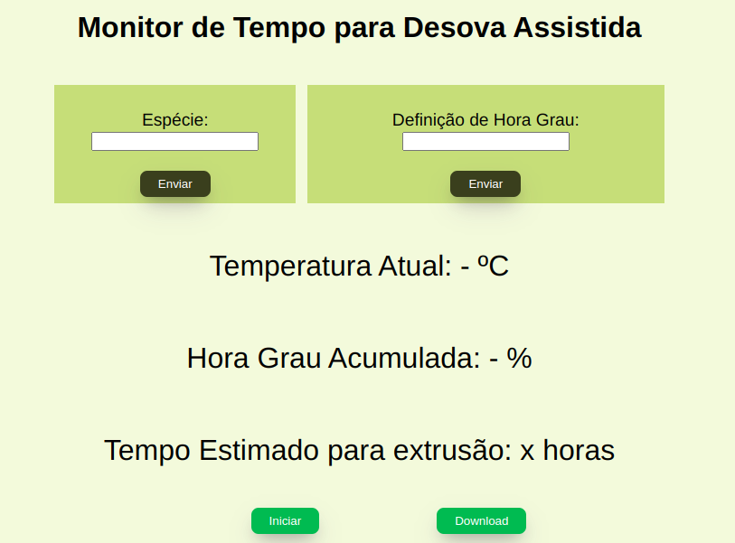

# PESCA-HORA-GRAU COM ESP32

## 📌 Sobre o Projeto

Este projeto é uma iniciativa em parceria com o **Laboratório de Inovação Tecnológica em Aquicultura - LITA/UEMA**, utilizando o microcontrolador **ESP32**, desenvolvido no ambiente **PlatformIO** com o framework do **Arduino**.

O objetivo principal é realizar o monitoramento e controle da desova assistida de peixes, utilizando sensores de temperatura e o cálculo de **Hora-Grau**. O sistema conta com uma interface web simples para acompanhamento e configuração.

---

## ✅ Funcionalidades

- [x] Monitoramento do acúmulo de Hora-Grau para uma espécie de peixe.
- [x] Notificação ao usuário sobre o início da extrusão.
- [x] Armazenamento dos dados de temperatura e hora-grau em um arquivo `.csv` no cartão SD.
- [x] Interface web para visualização e configuração do sistema (espécie do peixe, hora-grau alvo, etc).

---

## 🧱 Estrutura do Projeto

### 📂 `/data`
Contém os arquivos da **interface web**, construída com HTML, CSS e JavaScript.

### 📂 `/include`
Arquivos `.h` com funções principais:

#### `config_webserver.h`
- Configuração da rede Wi-Fi.
- Rotas para:
  - Informações do sensor.
  - Download de dados CSV.

#### `salvamento_de_dados.h`
- Inicialização do cartão SD.
- Escrita e limpeza de arquivos `.csv`.

#### `sensor_temperatura.h`
- Leitura da temperatura via **sensor DS18B20**.

---

## 🌐 Interface Web

#### `index.html`
Interface gráfica para:
- Monitorar o progresso da desova.
- Configurar parâmetros do sistema.

<div align="center">
  <br>
  <sub><b>Pagina Inicial do site</b></sub>
</div>

---

## ⚙️ Como Configurar e Rodar o Projeto

### 🖥️ Pré-requisitos

- [PlatformIO](https://platformio.org/) instalado no VSCode.
- Placa **ESP32** conectada via USB.
- Sensor de temperatura **DS18B20**.
- Cartão SD + módulo leitor.
- Cabo micro USB.

### 📦 Instalação

1. Clone o repositório:
   ```bash
   git clone https://github.com/alinembs/pesca-hora-grau-esp32.git

    ```
2. Abra o projeto no VSCode com o PlatformIO instalado.


3. Conecte o ESP32 e selecione a porta serial correta.

4. Faça o upload do código:
 ```
    pio run --target upload 
  ``` 

5. Faça o upload dos arquivos da interface web para o sistema SPIFFS:
``` 
    pio run --target uploadfs
```
6. Abra o monitor serial:
```
    pio device monitor
```

7. Acesse a interface web no navegador através do IP do ESP32 (exibido no monitor serial).

### 🧭 Diagrama da Arquitetura (Simplificado)
``` 
+------------------+
|  Página Web (UI) |
| HTML/CSS/JS      |
+--------+---------+
         |
         v
+--------+---------+
|   Servidor Web   | <-- ESP32
| (config_web.h)   |
+--------+---------+
         |
   +-----+-----+
   | Sensor    |  --> DS18B20
   | Temperatura
   +-----+-----+
         |
   +-----v-----+
   | Cartão SD  |
   | (CSV Logs) |
   +-----------+
```

### 👥 Colaboradores

As seguintes pessoas contribuíram para o desenvolvimento deste projeto:

<table> <tr> <td align="center"> <a href="https://github.com/alinembs"> <br> <sub><b>Aline Mariana Barros Silva</b></sub> </a> </td> </tr> </table>
